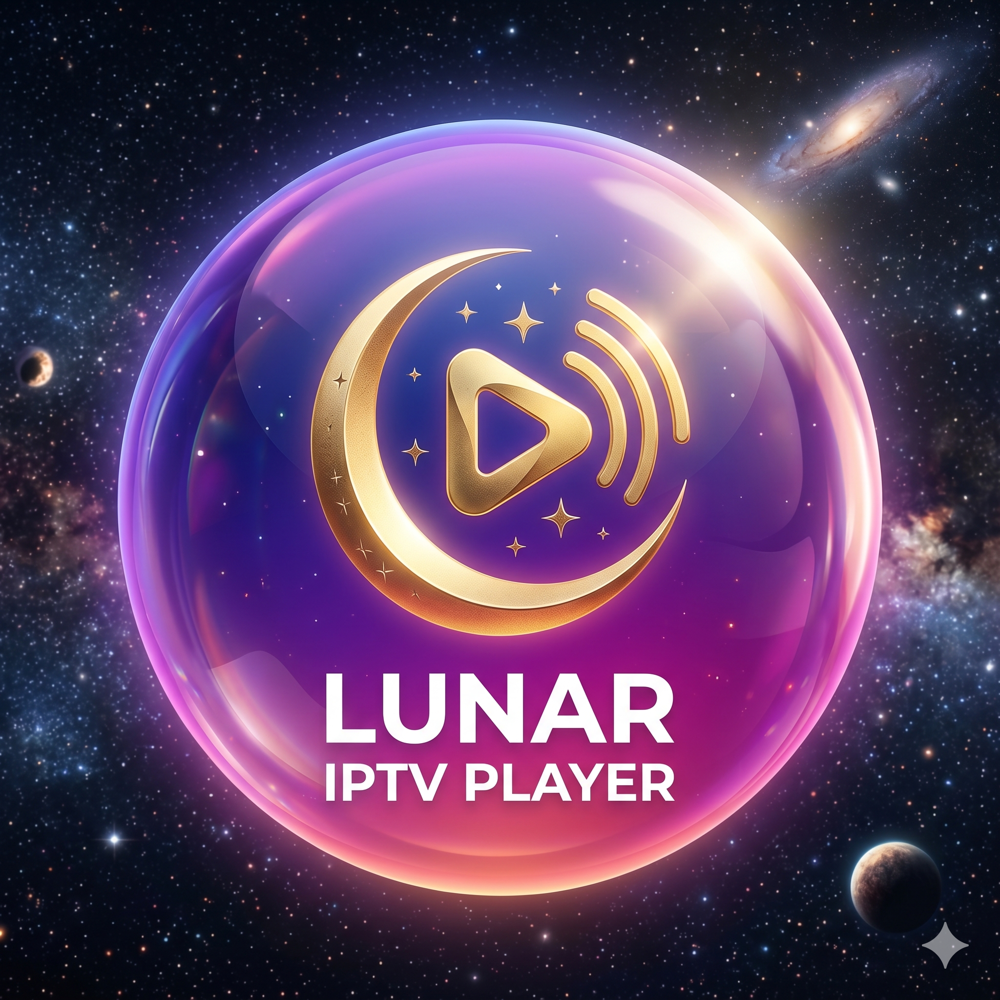
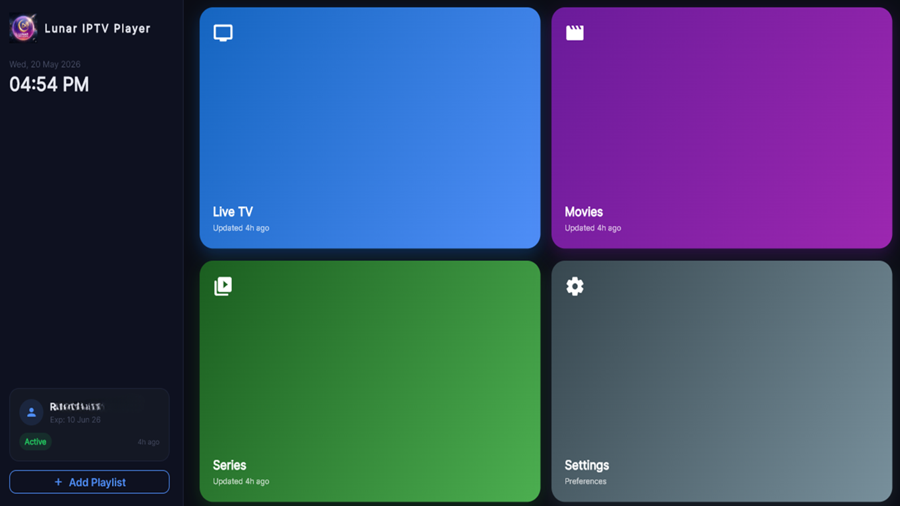
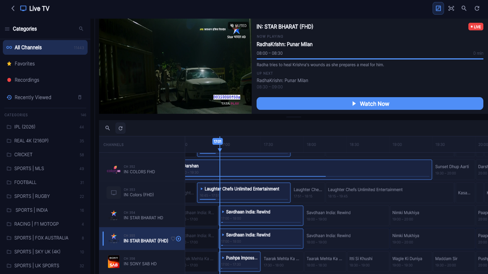
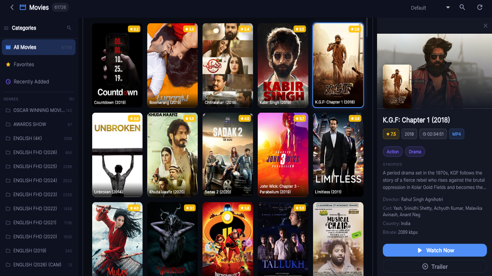
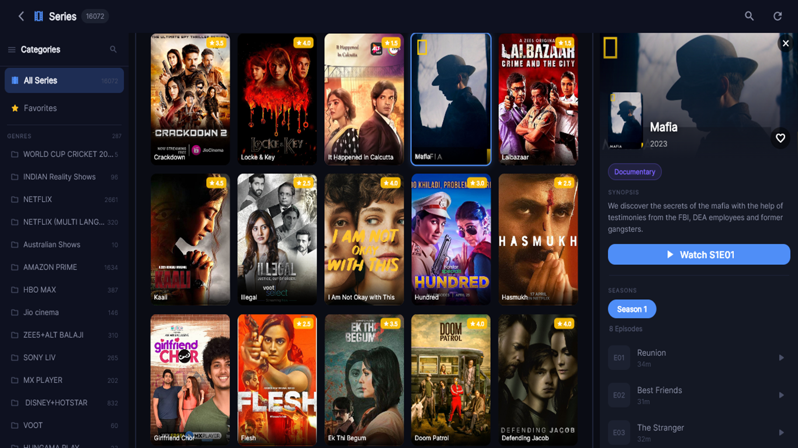

<div align="center">



# Lunar IPTV Player

**Premium cross-platform IPTV player built with Flutter**

[](https://flutter.dev)
[](https://dart.dev)
[](LICENSE)
[](https://flutter.dev/multi-platform)
[](https://github.com/yourusername/lunar-iptv-player/stargazers)

<br/>

**[🌐 Visit Website](https://lunar-iptv.web.app) · [🐛 Report Bug](https://github.com/yourusername/lunar-iptv-player/issues) · [✨ Request Feature](https://github.com/yourusername/lunar-iptv-player/issues)**

<br/>

[](YOUR_PLAY_STORE_URL)
&nbsp;&nbsp;
[](YOUR_MICROSOFT_STORE_URL)

</div>

---

## 📸 Screenshots

<div align="center">

|                    Home                     |                      Live TV                      |
| :-----------------------------------------: | :-----------------------------------------------: |
|  |  |

|                     Movies                      |                     Series                      |
| :---------------------------------------------: | :---------------------------------------------: |
|  |  |

</div>

---

## ✨ Features

<table>
<tr>
<td>

### 📺 Live TV

- Full Xtream Codes API support
- Electronic Program Guide (EPG) with timeline
- Inline mini-player with maximize animation
- Channel number navigation (TV remote)
- Favorites & Recently Viewed
- Category hiding with parental PIN
- Background auto-refresh

</td>
<td>

### 🎬 Movies

- Poster grid with shimmer loading
- Rich detail panel (plot, cast, badges)
- Trailer launch (YouTube app or browser)
- Language badges from stream metadata
- Favorites & Recently Viewed
- Recently Added (top 100)
- Sort by Name / Rating / Date

</td>
</tr>
<tr>
<td>

### 📼 Series

- Season & episode browser
- Multi-language detection per episode
- Favorites & Recently Viewed
- Series trailer support
- Episode duration display
- Smooth back-navigation (no home redirect)

</td>
<td>

### ⚙️ Settings & System

- Parental control with PIN per category
- Hidden categories management
- Remember last watched position
- Show / hide channel numbers
- In-app update (Play Store & MS Store)
- Auto cache management (14-day retention)

</td>
</tr>
</table>

---

## 🖥️ Platform Support

| Platform   | Status          | Notes                     |
| ---------- | --------------- | ------------------------- |
| 🤖 Android | ✅ Full support | Phone, Tablet, Android TV |
| 🍎 iOS     | ✅ Full support | iPhone, iPad              |
| 🪟 Windows | ✅ Full support | Microsoft Store           |
| 🐧 Linux   | ✅ Full support | Desktop                   |
| 🍏 macOS   | ✅ Full support | Desktop                   |
| 🌐 Web     | ✅ Full support | Firebase Hosting          |

---

## 🚀 Getting Started

### Prerequisites

- Flutter SDK `3.x` or later
- Dart SDK `3.x` or later
- An Xtream Codes IPTV subscription

### Installation

```bash
# Clone the repository
git clone https://github.com/yourusername/lunar-iptv-player.git
cd lunar-iptv-player

# Install dependencies
flutter pub get

# Run on your device
flutter run
```

### Build for release

```bash
# Android APK
flutter build apk --release

# Android App Bundle (Play Store)
flutter build appbundle --release

# Windows
flutter build windows --release

# Web
flutter build web --release
```

---

## 🏗️ Architecture

```
lib/
├── core/
│ ├── constants/ # App-wide constants
│ ├── router/ # GoRouter configuration
│ ├── theme/ # Dark theme & color tokens
│ └── utils/ # Platform helpers, launcher utils
├── models/ # Xtream API data models
├── providers/ # Riverpod state management
├── screens/
│ ├── add_playlist/ # Onboarding flow
│ ├── home/ # Dashboard
│ ├── live_tv/ # Live TV + EPG
│ ├── movies/ # VOD grid + detail
│ ├── player/ # Full-screen video player
│ ├── series/ # Series grid + episodes
│ ├── settings/ # Preferences
│ ├── splash/ # Launch screen
│ └── sync/ # Data sync screen
├── services/
│ ├── cache_service.dart
│ ├── storage_service.dart
│ └── xtream_service.dart
└── widgets/ # Shared UI components
```

---

## 📦 Key Dependencies

| Package                | Purpose           |
| ---------------------- | ----------------- |
| `flutter_riverpod`     | State management  |
| `go_router`            | Navigation        |
| `media_kit`            | Video playback    |
| `hive_flutter`         | Local persistence |
| `cached_network_image` | Image caching     |
| `flutter_animate`      | UI animations     |
| `url_launcher`         | External links    |
| `upgrader`             | In-app updates    |

---

## 🤝 Contributing

Contributions are welcome!

1. Fork the repository
2. Create your feature branch (`git checkout -b feature/amazing-feature`)
3. Commit your changes (`git commit -m 'Add amazing feature'`)
4. Push to the branch (`git push origin feature/amazing-feature`)
5. Open a Pull Request

---

## 📄 License

Distributed under the MIT License. See [`LICENSE`](LICENSE) for more information.

---

## ⚠️ Disclaimer

Lunar IPTV Player is a **standalone media player**. We do not provide, sell, or endorse any IPTV subscriptions or content. All content is provided solely by third-party IPTV services configured by the user. Ensure you have the legal right to access any content you stream.

---

<div align="center">

Made with ❤️ using Flutter

[⬆ Back to top](#lunar-iptv-player)

</div>
```
